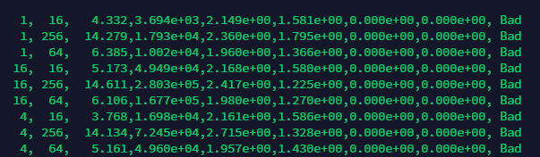
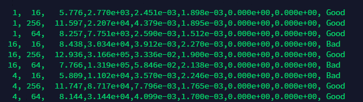

## 总述
- 原始模型的名称及链接: [wenet](https://github.com/wenet-e2e/wenet)
- 优化效果（精度和加速比）：相比于官方fp16模式，速度提升30%；精度相比于浮点模型，误差在1e-3范围。
- 在Docker里面代码编译、运行步骤的完整说明
  - 拉去镜像：docker pull registry.cn-hangzhou.aliyuncs.com/trt2022/dev
  - 运行镜像：docker run -it --gpus=all --name trt2022 registry.cn-hangzhou.aliyuncs.com/trt2022/dev
  - 下载代码：git clone https://github.com/congyang12345/wenet.git
  - 准备运行：cd wenet
  - 运行代码：bash build.sh && python /workspace/testEncoderAndDecoder.py 
## 原始模型
### 模型简介
WeNet 是一款面向工业落地应用的语音识别工具包，提供了从语音识别模型的训练到部署的一条龙服务，其主要特点如下：

* 使用 conformer 网络结构和 CTC/attention loss 联合优化方法，统一的流式/非流式语音识别方案，具有业界一流的识别效果。
* 提供云上和端上直接部署的方案，最小化模型训练和产品落地之间的工程工作。
* 框架简洁，模型训练部分完全基于 pytorch 生态，不依赖于 kaldi 等复杂的工具。
* 详细的注释和文档，非常适合用于学习端到端语音识别的基础知识和实现细节。
* 支持时间戳，对齐，端点检测，语言模型等相关功能。

### 模型优化的难点
1. 官方提供的onnx模型并不能直接转换到TensorRT上，报错***Error Code 2: Internal Error (Slice_79requires bool I/O but node can not be handled by Myelin.)***，这时需要将原来onnx模型***Squeeze->Not->Slice->Slice***换成***Squeeze->Cast->Slice->Slice->Cast->Not***这种形式就可以转到TensorRT上。
2. 按第一步修改之后，模型可以用fp32格式转到TensorRT上，这时精度是可以满足需求的，但是如果转成fp16的形式，精度就会在某些场景下非常差。

## 优化过程
针对fp16精度掉点严重的问题，经过和导师的讨论交流，最后发现是在layernorm算子这块出现了较大误差，layernorm在onnx里面被拆分成了9个小算子，这些小算子的在TensorRT转换的时候会被融合成不同的算子，这会导致一些场景下中间位宽不够。最后决定将layernorm单独写成一个plugin，layernorm的plugin在代码的layernorm文件夹下，主要参考了[fastertransformer](https://github.com/NVIDIA/FasterTransformer)代码。编译成plugin之后，精度相比于原始fp16模型有较大提升，同时运行速度也有较大提升。

## 精度与加速效果
fp16 raw

fp16 with layernorm plugin

